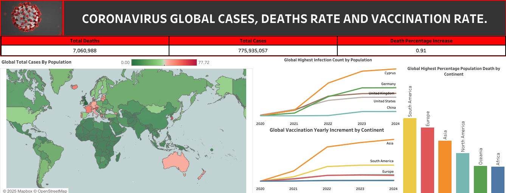

# Analysis of Global Coronavirus Case Rate Death Rate and Impact of Vaccination
## STATEMENT OF TASK
**TO ANALYSIS THE GLOBAL CORONAVIRUS CASE RATE, DEATH RATE AND IMPACT OF VACCINATION**

## EXECUTIVE SUMMARY
From the onset of the COVID-19 pandemic in early 2020 through the end of 2024, the global community has faced significant challenges.
The world has witnessed the profound effects of COVID-19, with significant cases and fatalities. Vaccination has played a crucial role in reducing the disease's burden, emphasizing the importance of sustained public health initiatives.

According to data from Our World in Data, the cumulative number of confirmed COVID-19 cases worldwide reached substantial figures, reflecting the virus's extensive spread. The death rate, while varying across regions and periods, underscored the severity of the pandemic's impact on public health.

Vaccination efforts have been pivotal in mitigating the virus's effects. The introduction and widespread administration of COVID-19 vaccines have been associated with a notable decrease in both case and death rates. Data indicates that vaccinated populations experienced lower mortality rates compared to their unvaccinated counterparts, highlighting the efficacy of vaccines in preventing severe outcomes.

Despite these advancements, challenges such as vaccine distribution disparities and the emergence of new variants have posed ongoing obstacles. Continued efforts in vaccination campaigns, public health interventions, and global cooperation remain essential to manage and eventually overcome the pandemic's enduring impact.

**THE MAJOR POINTS OF FOCUS IN THIS ANALYSIS ARE:**
1.  Global case rate
2.  Global death rate
3.  Global impact of vaccination

## DATA SOURCE
The data used was sourced from [the "Our World in Data" website:](https://docs.owid.io/projects/covid/en/latest/dataset.html#download-our-complete-covid-19-dataset-csv-xlsx-json)

### ANALYSIS PROCEDURES 
**Two table datasets extracted for exploration**

[Covid Death Table Dataset](https://1drv.ms/x/c/b8ac0467681b52ee/EcxN0IBXOqdHk7Tfuk5d86sBR5QIkD6wn_nKAUlBF6dpmA?e=gNCScR&nav=MTVfezAwMDAwMDAwLTAwMDEtMDAwMC0wMDAwLTAwMDAwMDAwMDAwMH0)

[Covid Vaccination Table Dataset](https://1drv.ms/x/c/b8ac0467681b52ee/EVSPncs5ZnVOkwVPUjqQb34BWbhH09VLZhWy-JkgKYLXeg?e=l6eV9K&nav=MTVfezAwMDAwMDAwLTAwMDEtMDAwMC0wMDAwLTAwMDAwMDAwMDAwMH0)

## EXPLORATORY DATA ANALYSIS (EDA) 
EDA was conducted on the data using SQLServer:
1.  Selecting the data necessary for the analysis
2.  Joining Covid-death and vaccination tables
3.  checking the rate at which COVID-19 spread globally
4.  using CTE to calculate the increment of vaccination by population
   
**The link to the SQL queries is stated below:**
[SQL Query](Covid-19_SQLQuery.sql)

**Visualization on Tableau**

[Click to view the full detail of the data visualization on Tableau](https://public.tableau.com/views/coronavirusanalysis_17387076114360/Dashboard1?:language=en-US&:sid=&:redirect=auth&:display_count=n&:origin=viz_share_link)

## MAJOR FINDINGS
### These were my findings
1. Cyprus with a population of 886,007, has 77.1% (683,111) of its population infected with the coronavirus. China with a population of over 1.4 billion has 6.97% (over 99 million people) of its population infected with the coronavirus. The virus would have wiped out the whole Cyprus population
2. South America has the highest death rate by population, followed by Europe and Asia. Africa has the lowest death rate.
3. Rate of vaccination was highest in Asia followed by South America.

## MY RECOMMENDATION
### The following are my recommendations:
1.   Vaccination campaigns should continue across the continents. The more we vaccinate, the more coronavirus is reduced.
2.   People across countries should be sensitized more to the risk involved in contracting COVID-19 and employing preventive measures to stay safe.
3.   More funds should be invested in research and development not just to manage COVID-19 but to eradicate it
